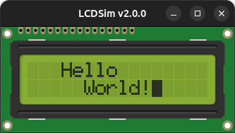

# LCDSim-v2

This is an update of the library [LCDSim](https://github.com/dylangageot/LCDSim).
The purpose of this project is to update the library so it uses SDL2, since the previous version of this library uses
SDL v1.2, which is deprecated.

LCDSim is a library, written in **C**, which allows you to simulate a HD44780 LCD 16x2 or 20x4 display on your computer.




The project is built with the following software:
- Meta-build system: cmake 3.28.2 (snap version)
- Build system: GNU Make 4.3
- Compiler: gcc 12.3.0
- OS: Ubuntu 23.04

The project uses the following libraries:
- SDL2 v2.0.12
- SDL2_image v2.0.3

## Compile the project and run the emulator

To compile the project run the following command:
```bash
cmake -S ./ -B build/
cd build
make
```

To run the example:
```bash
cd build/examples/hello-world
./hello-world
```

## Select LCD type
In file lcdsim/CMakeLists.txt are the following definitions to select between 16x2 or 20x4 LCD type or between green and
blue LCD display. By default the LCD 16x2 green display is selected:
```cmake
PRIVATE LCDSIM_20x4
PRIVATE LCDSIM_BLUE
```

## Documentation

- [How to configure a third party library](docs/how-to-use-library.md)
- [Functions description](docs/functions.md)
- [CGROM organization](docs/cgrom-organization.md)

## Resources
- [LCD 16x2 image](http://paulvollmer.net/FritzingParts/parts/lcd-GDM1602K.html)
- [LCD 20x4 image](https://johnny-five.readthedocs.io/en/latest/lcd-runner-20x4/)
- [Instruction Set](https://mil.ufl.edu/3744/docs/lcdmanual/commands.html)