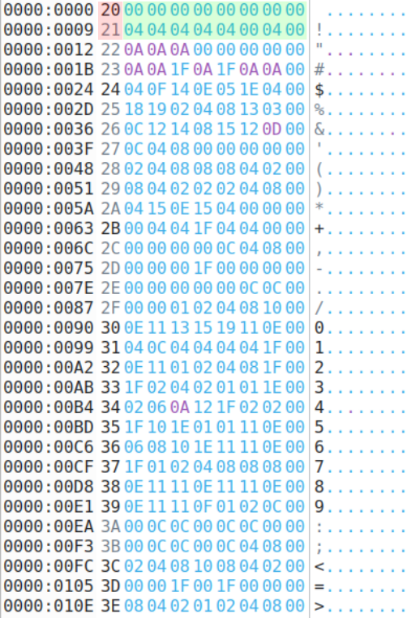
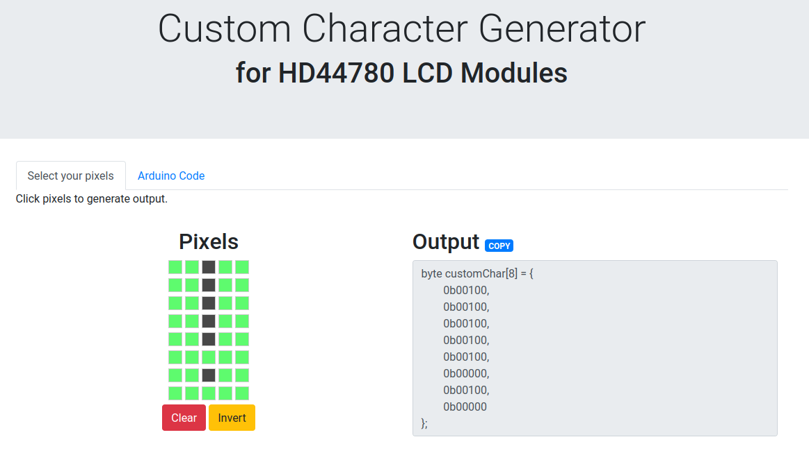

# CGROM organzation

## How the CGROM get the drawing of a character?

To load all the character into the CGROM, LCDSim reads a file called cgrom.bin. This file contains the representation
of a bunch of ASCII code (0x20 ' ' to 0x7D '}' in the original cgrom.bin).

I've organised the hex editor to display 9 bytes on each line. The first byte of the row (highlighted in red) is the
ASCII code that we want to draw onto the LCD display. The other 8 bytes (highlighted in green) correspond to the
pixels of each character. The first byte represent the top pixels of the character and the last byte is the bottom
pixels.

## How to update the cgrom.bin file?

Take the '!' character. On this [online character generator](https://omerk.github.io/lcdchargen/), I've drawn the
character and I will put it in the cgrom.bin:

The generator will give us a code of an array in C. Just look at the binary data wrote in the array and convert it in
hexadecimal to insert this drawing of the character in cgrom.bin.